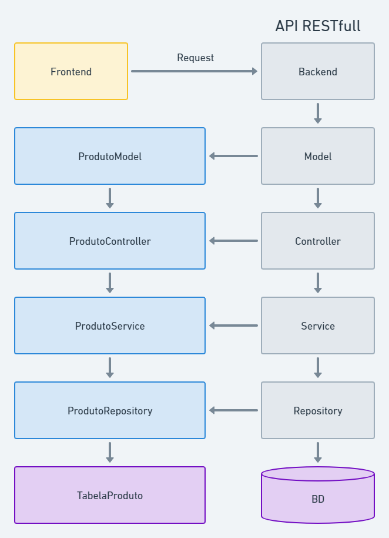

# first-restfull-api

Projeto baseado nas aulas do professor Weberson Rodrigues, sendo desenvolvida uma RESTful API para controle de produtos. 

Boas práticas foram aplicadas seguindo os conceitos de arquitetura com a organização do projeto por Model, Repository, Service e Controller. 

Foi utilizado o programa Insomnia para testar os verbos Get, Post, Put e Delete. 

 
